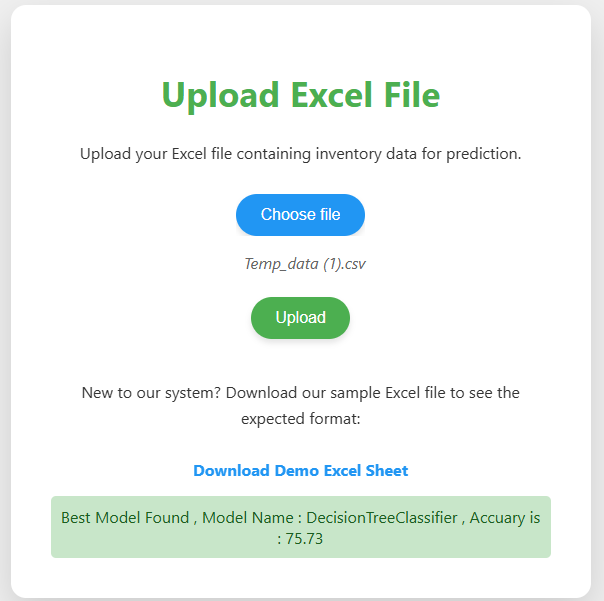
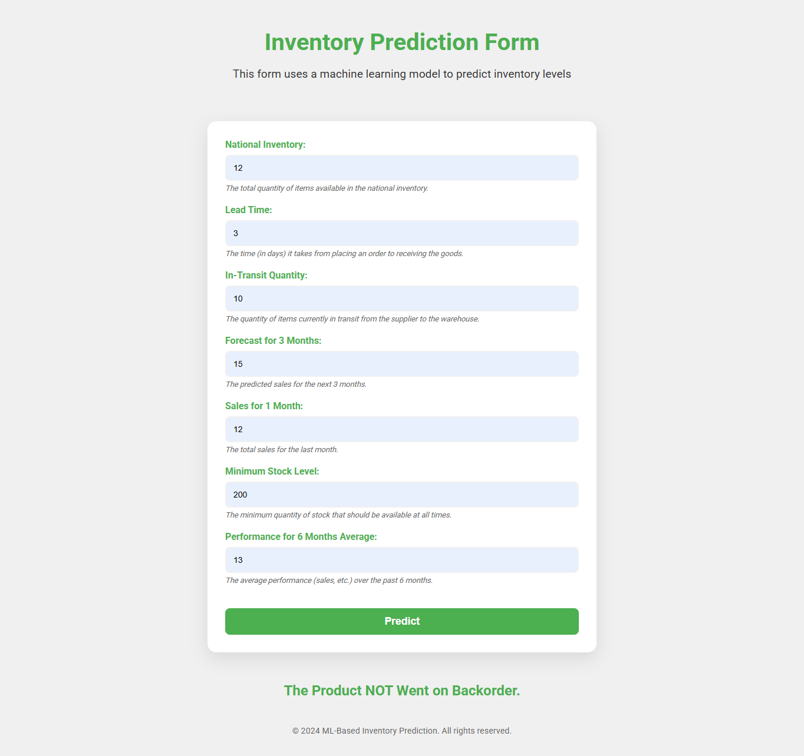
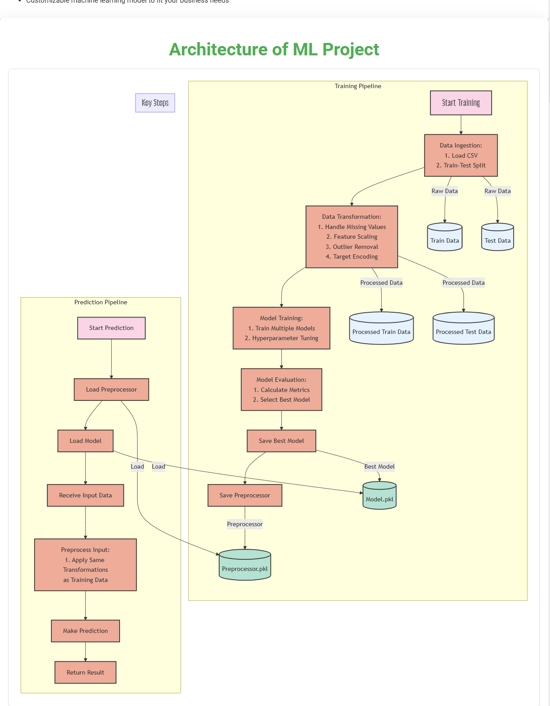

# End-to-End Intelligent Inventory Management System

## Overview

This project implements an intelligent backorder prediction system using machine learning to help businesses manage their inventory effectively. The system predicts whether a product will go on backorder based on various inventory and sales features, enabling proactive inventory management decisions.

## 🎥 Video Demonstration

Watch the complete project walkthrough and demonstration: [Project Demo Video](https://drive.google.com/file/d/1f4eqkmgzdNJIQ5Jb0jjTKxPAS4P_SvgB/view?usp=sharing)

## 📸 Screenshots

**Custom Training Interface:**


**Model Prediction Interface:**


## 🏗️ Project Architecture



## 📊 Features

- **Data Ingestion**: Automated data loading and preprocessing from CSV files
- **Data Transformation**: Advanced preprocessing including outlier removal, missing value handling, and feature scaling
- **Model Training**: Multiple algorithm comparison (Random Forest, Decision Tree, SGD, KNN, Gradient Boosting)
- **Custom Data Training**: Upload your own dataset for model training
- **Real-time Predictions**: Web interface for individual product backorder predictions
- **Model Persistence**: Automated model and preprocessor saving/loading

## 🔧 Key Components

### Core Modules

1. **`src/logger.py`**: Comprehensive logging system with timestamped log files
2. **`src/exception.py`**: Custom exception handling for better error management
3. **`src/utils.py`**: Utility functions for:
   - Object serialization/deserialization
   - Outlier removal using 3-sigma rule
   - Target column encoding (Yes/No → 1/0)

### Data Pipeline

4. **`src/components/data_ingestion.py`**: 
   - Handles CSV data loading
   - Automated train-test split
   - Configurable data paths

5. **`src/components/data_transformation.py`**: 
   - Missing value imputation using median strategy
   - Feature scaling with StandardScaler
   - Data balancing using resampling techniques
   - Outlier removal for both training and test data

6. **`src/components/model_trainer.py`**: 
   - Multi-algorithm evaluation framework
   - F1-score based model selection
   - Automated best model selection and persistence

### Prediction System

7. **`src/pipelines/prediction_pipeline.py`**: 
   - Real-time prediction interface
   - Custom data input handling
   - Model loading and inference

8. **`src/pipelines/training_pipeline.py`**: 
   - End-to-end training orchestration
   - Pipeline coordination between components

### Web Application

9. **`app.py`**: Flask web application with:
   - Custom dataset upload and training
   - Individual prediction interface
   - File upload validation
   - Error handling and user feedback

## 🚀 Getting Started

### Prerequisites

- Python 3.7 or higher
- Required packages listed in `requirements.txt`

### Installation

1. **Clone the repository**
   ```bash
   git clone <repository-url>
   cd End-to-End-Intelligent-Inventory-Management-System
   ```

2. **Create virtual environment**
   ```bash
   conda create -n inventory_system python=3.7
   conda activate inventory_system
   ```

3. **Install dependencies**
   ```bash
   pip install -r requirements.txt
   ```

### Usage

#### Web Application
```bash
python app.py
```
Access the application at `http://localhost:5000`

#### Training Pipeline (Programmatic)
```python
from src.pipelines.training_pipeline import Training_Pipeline

# Train with default dataset
pipeline = Training_Pipeline()
result = pipeline.initiate_training_pipeline()

# Train with custom dataset
pipeline = Training_Pipeline("path/to/your/data.csv")
result = pipeline.initiate_training_pipeline()
```

#### Making Predictions
```python
from src.pipelines.prediction_pipeline import CustomData, PredictPipeline

# Create prediction data
data = CustomData(
    national_inv=24.0,
    lead_time=8.0,
    in_transit_qty=0.0,
    forecast_3_month=3456.0,
    sales_1_month=10.0,
    min_bank=7.0,
    perf_6_month_avg=1.0
)

# Make prediction
pipeline = PredictPipeline()
df = data.get_data_as_dataframe()
prediction = pipeline.predict(df)
```

## 📋 Input Features

The model uses the following features for prediction:

- **`national_inv`**: National inventory level
- **`lead_time`**: Lead time for product delivery
- **`in_transit_qty`**: Quantity currently in transit
- **`forecast_3_month`**: 3-month sales forecast
- **`sales_1_month`**: Previous month sales
- **`min_bank`**: Minimum recommended stock level
- **`perf_6_month_avg`**: 6-month average performance

## 🤖 Supported Algorithms

- Random Forest Classifier
- Decision Tree Classifier
- Stochastic Gradient Descent (SGD) Classifier
- K-Nearest Neighbors (KNN) Classifier
- Gradient Boosting Classifier

The system automatically selects the best performing model based on F1-score.

## 📁 Project Structure

```
├── src/
│   ├── components/
│   │   ├── data_ingestion.py
│   │   ├── data_transformation.py
│   │   └── model_trainer.py
│   ├── pipelines/
│   │   ├── training_pipeline.py
│   │   └── prediction_pipeline.py
│   ├── logger.py
│   ├── exception.py
│   └── utils.py
├── notebooks/
│   └── back_order_predict.ipynb
├── artifacts/           # Generated models and preprocessors
├── uploads/            # User uploaded datasets
├── templates/          # HTML templates
├── app.py             # Flask web application
├── requirements.txt
└── README.md
```

## ☁️ Deployment

This application was previously deployed on AWS (Amazon Web Services), leveraging its robust, scalable, and reliable infrastructure. However, the deployment is currently not active.

**Note: The application is not currently deployed on AWS.**

## 🔍 Data Analysis

The project includes a comprehensive Jupyter notebook (`notebooks/back_order_predict.ipynb`) with:
- Exploratory Data Analysis (EDA)
- Data preprocessing steps
- Model experimentation
- Feature correlation analysis

## ⚠️ Important Notes

- Ensure all data files follow the expected schema with required columns
- The system handles class imbalance through resampling techniques
- Models are automatically saved in the `artifacts/` directory
- All exceptions are logged with detailed information for debugging

## 🚀 Future Enhancements

- Advanced feature engineering
- Hyperparameter tuning for better model performance
- Real-time data pipeline integration
- Advanced visualization dashboard
- API endpoints for system integration

## 🤝 Contributing

Feel free to contribute to this project by:
- Reporting bugs
- Suggesting new features
- Improving documentation
- Submitting pull requests

---

**Happy Coding!** 🎉
